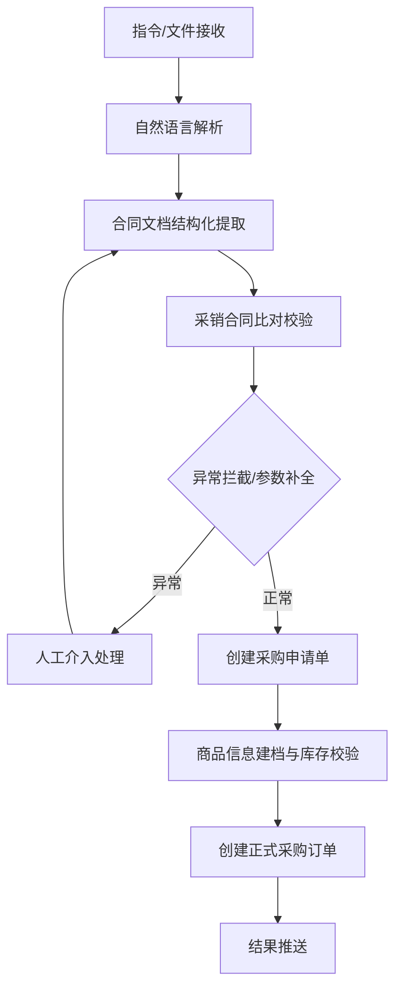

# AI 俱乐部课题 3：打造企业流程中的 AI Agent 数字员工

> 来源：已打开的飞书云文档页面截图与本地 OCR 识别整理。本文为结构化整理版，非飞书原文逐字导出。

## 课题基本信息

| 项目 | 内容 |
| --- | --- |
| 课题主题 | 打造企业流程中的 AI Agent 数字员工 |
| 岗位方向 | 公司采购经理数字员工 |
| 一句话任务 | 交代任务，自行执行流程，完成交付 |
| 周期 | 3 周，2026/6/29 至 2026/7/19 |

## 一、课题概述

采购是供应链环节中非常重要的领域，指公司内部完成向供应商采购的流程。通过采购流程，企业确定向谁采购、采购什么、价格和付款条款，并形成采购入库、采购对账等凭证。

本课题旨在设计并实现一个采购经理 AI Agent 数字员工。该数字员工能够通过自然语言接收任务指令，自动解析业务文档，驱动企业采购流程从合同获取到订单创建的全链路自动化执行。

## 二、术语解释

| 术语 | 说明 |
| --- | --- |
| 销售合同 | 向客户销售产品或服务的履约合同，需要客户和公司都盖章后生效，是采购流程的前置条件。 |
| 采购合同 | 供应商向公司提供产品或服务的履约合同，需要公司和供应商盖章后生效，是采购流程的必要条件。 |
| 采购申请单 | 公司采购流程中，用于确定采购意向的业务单，并不会发生实际采购动作，主要用于管理上确定可以采购。 |
| 采购订单 | 公司采购流程中实际发生采购动作的业务凭证单，采购订单写入系统后，会执行实际供应链动作。 |

## 三、工作场景

### 场景描述

某科技公司销售部刚与客户签订了一份销售合同，需要采购部门尽快完成向供应商的采购，以保证按时交付。

### 完整工作流程

1. 销售发起需求：销售人员将用印后的销售合同发送给采购经理，并口头说明“这个合同客户已经盖章了，走一下采购流程。”
2. 采购经理接收并解析合同：打开销售合同，提取客户名称、产品名称、数量、单价、金额、交付日期等关键信息；同时找到对应采购合同，准备比对。
3. 采销合同比对：逐项核对销售合同与采购合同，包括产品名称、数量、采购单价与销售单价之间的利润空间、交付日期、付款条款等。
4. 异常处理：如发现数量不一致、单价偏差过大、缺少交付日期等差异，采购经理需联系销售人员确认差异是否合理，或联系供应商补充修正。
5. 创建采购申请单：比对通过后，在系统中创建采购申请单，填写供应商、采购内容、金额等信息。
6. 商品信息建档与库存校验：根据采购申请创建或补全商品信息，并进行库存校验。
7. 创建正式采购订单：审批通过后创建采购订单。
8. 结果推送：将处理结果通过飞书消息通知相关人员。

### 核心工作流程图

## 四、核心能力体现

- 口语化任务提起：自由话术自动解析，无需固定指令格式。
- 文档结构化解析：对 Word/PDF 文档解析出结构化数据。
- 企业流程异常处理：支持采销合同比对异常、申请创建异常、库存校验异常等处理。
- 逻辑错误自动识别：检测参数异常、参数缺失并给出提示。
- 自动生成业务单：自动创建采购申请单、商品信息、采购订单。
- 办公工具调用：通过飞书对话接收和发送任务结果，并支持 IM 消息通知。

## 五、真实交互演示案例

### 案例一：采购申请自动创建

飞书对话：采购申请流程。

销售张明 10:23：

> 帮我看一下这个销售合同，客户已经盖章了，走一下采购流程吧。

AI 采购经理数字员工 10:23：

> 收到，我正在解析销售合同，请稍候...

合同解析完成后，提取关键信息，并进行采销合同比对：

- 数量匹配
- 单价偏差 <= 5%
- 交付日期合规

采购申请单已自动创建并提交：

- 申请编号：PA-20260628-0037
- 采购内容：智能网关 Pro x 200 台
- 供应商：YY 电子科技
- 状态：已提交审批

系统提示：审批通过后会通知相关人员。

销售张明 10:25：

> 好的，收到。

### 案例二：采购订单自动创建

飞书对话：采购订单流程。

销售张明 14:10：

> PA-20260628-0037 审批通过了，帮我下采购订单吧。

AI 采购经理数字员工 14:11：

> 收到，正在处理 PA-20260628-0037 的采购订单...

第一步：创建采购商品信息。

- 商品名称：智能网关 Pro
- 预计到货：2026-07-15

采购订单已创建并提交，预计 3 个工作日内供应商确认发货。

销售张明 14:12：

> 效率真高，谢谢！

### 案例三：异常处理 - 采销合同比对不通过

飞书对话：异常处理场景。

销售李婷 11:05：

> 这个合同客户盖完章了，帮我走采购。

AI 采购经理数字员工 11:06：

> 收到，正在解析合同...

采销合同比对发现异常，采购申请暂未提交：

| 异常项 | 说明 |
| --- | --- |
| 产品数量不一致 | 销售合同：数据采集终端 x 500 台；采购合同：数据采集终端 x 300 台。 |
| 单价偏差超限 | 销售合同单价：¥800/台；采购合同单价：¥950/台，偏差 18.75%，阈值 5%。 |
| 采购合同缺少交付日期 | 需确认或补充交付日期后再提交。 |

处理建议：请确认以上差异是否合理，或补充修正后再提交。

## 六、实施阶段及阶段交付物

| 阶段 | 时间 | 内容 |
| --- | --- | --- |
| 第一阶段 | 6/29 | 开班仪式 |
| 第二阶段 | 6/30 - 7/4，第 1 周 | 第一阶段实施 |
| 第三阶段 | 7/7 - 7/11，第 2 周 | 第二阶段实施 |
| 第四阶段 | 7/14 - 7/18，第 3 周 | 第三阶段实施 |
| 结业 | 7/19，周六 | 结业仪式，主题为成果汇报与评优 |

结业交付物：

1. 最终成果汇报 PPT
2. 项目源码仓库
3. 各组员个人贡献说明

## 七、具体交付物及验收标准

### 交付物验收

| 序号 | 验收项 | 验收标准 | 阶段 |
| --- | --- | --- | --- |
| 7 | 参数异常检测 | 能检测参数缺失、格式异常、逻辑矛盾等，并给出明确提示。 | 第 2 周 |
| 8 | 采购商品创建 | 根据采购申请自动创建商品信息，包含名称、规格、单位、单价等字段。 | 第 3 周 |
| 9 | 采购订单创建 | 商品创建完成后自动生成采购订单并提交，通知用户订单结果。 | 第 3 周 |
| 10 | 端到端全链路 | 从接收任务到最终订单创建，全流程自动化执行、无人干预。 | 第 3 周 |

### 质量验收

| 序号 | 验收维度 | 验收标准 | 说明 |
| --- | --- | --- | --- |
| 1 | 响应时效 | 单次任务端到端响应时间 < 30 秒，不含人工确认等待。 | 从用户发送消息到收到最终结果。 |
| 2 | 异常处理率 | 合同比对失败、参数缺失等异常场景 100% 有明确提示，不出现静默失败。 | 不允许无响应或直接报错堆栈。 |
| 3 | 代码规范 | 代码结构清晰，有注释、有 README，关键模块有单元测试。 | 可复现、可维护。 |
| 4 | 演示完整性 | 结业汇报时能现场演示至少 2 个完整场景，包含正常流程和异常流程。 | 不允许仅播放录屏。 |

### 协作与沟通

| 维度 | 分值 | 说明 |
| --- | --- | --- |
| 协作与沟通 | 20% | 团队内沟通效率与响应速度；跨组协作时的配合度；汇报表达的清晰度；对他人问题的帮助意愿。 |

### 团队评优（满分 100 分）

| 维度 | 分值 | 说明 |
| --- | --- | --- |
| 课题完成度 | 30% | PO 验收项的完成比例；全链路是否真正跑通；交付物的完整性与质量；是否超出基础要求。 |
| 交付质量 | 25% | Demo 演示的流畅度与稳定性；异常场景的覆盖广度；用户体验是否自然；代码可维护性与文档完善度。 |
| 团队协作 | 25% | 分工合理性；组长协调与推进能力；周报质量与节点达成率；面对困难时的团队应对。 |
| 创新与亮点 | 20% | 是否有超出课题要求的额外功能和业务规则；技术方案的独特性或创新性；用户体验亮点设计；可复用性。 |

## 可能延伸的问题

- 打造采购 AI Agent 的 3 个核心落地技巧。
- 采购 AI 数字员工的验收核心标准有哪些。
- 企业 AI Agent 数字员工的最新实践方向。
- 企业流程 AI Agent 的落地验收标准是什么。
- AI Agent 验收的核心标准有哪些。
- 打造采购 AI 数字员工的最佳实践要点。
