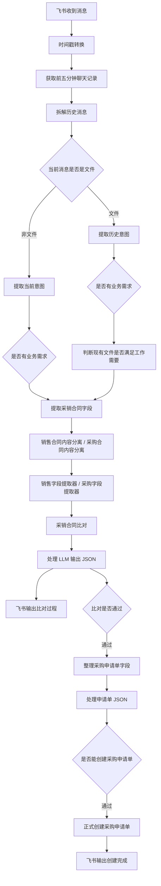

# 采购经理数字员工项目整理

## 1. 项目背景

本项目目标是做一个“采购经理数字员工”，用于在企业采购流程中辅助处理采购相关业务。

当前技术路线：

```text
飞书 Bot
↓
Dify Workflow
↓
合同文件读取 / 意图识别 / 字段提取
↓
采销合同比对
↓
采购申请单生成
↓
飞书消息回复用户
```

目前整体已经进入集成调试阶段。

## 2. 核心业务目标

用户通过飞书和数字员工交互，例如：

```text
请帮我比对这两份采销合同，通过后创建采购申请单
```

数字员工需要完成：

1. 识别用户是否有采购相关业务意图。
2. 读取用户上传的合同文件。
3. 区分销售合同和采购合同。
4. 提取两份合同中的关键字段。
5. 做采销合同比对。
6. 如果比对通过，生成采购申请单。
7. 如果不通过，告诉用户具体异常原因。
8. 最终通过飞书 Bot 回复处理结果。

## 3. 当前 Dify DSL 文件

| 文件 | 作用 |
|---|---|
| `采购经理数字员工.yml` | 主工作流，正式入口，整合飞书触发、意图识别、文件处理、采销合同比对、采购申请单创建、飞书回复 |
| `申请书字段提取并创建（未接入飞书）.yml` | 采购申请单创建子模块，负责从采购合同字段生成采购申请单、校验字段、模拟创建 |
| `模拟对比工作流.yml` | 采销合同比对子模块，负责解析销售合同、采购合同，并比对商品、数量、价格、交付日期等 |
| `文件读取.yml` | 文件读取测试模块，用于测试文档提取器和飞书文件读取 |
| `test_lyu.yml` | 飞书消息回复/话术测试模块 |
| `test_3.yml` | Lark 触发器测试模块 |
| `test_2.yml` | 早期 Chatflow 基础对话测试 |
| `test.yml` | 早期 Chatflow + 飞书发送工具测试 |

现在真正应该重点维护的是：

```text
采购经理数字员工.yml
```

其他文件更像实验模块或子功能原型。

## 4. 主工作流结构



## 5. 销售合同和采购合同来源

在主流程 `采购经理数字员工.yml` 里，销售合同和采购合同不是两个独立上传变量，而是来自同一个文档提取链路：

```text
飞书消息里的文件
↓
提取采销合同字段 document-extractor
↓
销售合同内容分离
采购合同内容分离
```

主流程目前假设文档提取器能拿到合同文本，然后用 LLM 分离销售合同和采购合同。

在 `模拟对比工作流.yml` 里则更清晰：

```text
sales_file      销售合同文件
purchase_file   采购合同文件
```

因此：

- 主流程：两份合同来自飞书文件，经同一个文档提取器后再分离。
- 模拟对比工作流：销售合同和采购合同分别来自两个独立文件输入。
- 调试建议：如果主流程分离不稳定，最好要求文件名包含“销售合同”“采购合同”，或者改成两个明确文件入口。

## 6. 组内历史进度

### 0701

- 工作流主框架搭建约四成。
- 基础输入与条件分支完成。
- 销售合同对比字段确定。
- 根据销售合同字段寻找采购合同逻辑。
- 销售合同文件/编号输入时的主码提取策略。
- Word/PDF 结构化解析模块。
- 口语化意图识别模块。

### 0702

- 采销合同比对实现模块。
- 工作流主框架约五成。
- 飞书 Bot 接入与测试。
- 第一类、第二类输入处理逻辑。
- 输入非法提示输出两遍。
- 采购合同数据库对接待做。
- 第三类输入待实现。
- 异常处理待完善。

### 0703

- 合同内容提取模块完善。
- 合同对比逻辑和字段优化。
- 口语化意图识别完善。
- 模拟对比工作流模块化。
- 机器人单聊实现。
- 主要难点变成“文件与意图的分步读取”。

### 0704

- 意图与文件异步处理实现。
- 时间戳转字符串。
- 通过访问会话历史消息读取合同文件。
- 问题：Dify Workflow 是单轮接收，多轮需要 Chatflow，但 Chatflow 不支持 Lark 触发器。

### 0705

- 重构流程，减少 LLM 节点。
- 实现先文件后意图、先意图后文件。
- 优化合同对比输出提示词。
- 增加先文件后意图时的显式提示。
- 发现 Lark 工具历史消息无法捕获历史文件数组，`file[array]` 永远是 `None`。

## 7. 各成员大致负责内容

| 成员 | 主要贡献 |
|---|---|
| 刘子鸣 | Lark 触发器、飞书 Bot、消息处理、历史消息、异步文件/意图处理、主流程重构 |
| 侯星宇 | 合同字段提取、采销合同比对字段、合同解析、比对逻辑 |
| 蔡源博 | LLM 结构化输出 JSON、字段提取后输出逻辑、文件读取测试 |
| 于米提 | 模拟对比工作流模块化 |
| 吕俊睿 | 合同对比后输出提示词、飞书回复话术测试 |

## 8. 当前主要问题

### 8.1 变量引用错误

主流程里 `现有文件能否满足工作需要` 节点出现明显错误：

```text
{{#17832710883880.text#}} 和 {{#17832710883880.text#}} 是两份合同内容
```

两个变量都引用了采购合同内容。应该改为：

```text
{{#17832710829940.text#}} 和 {{#17832710883880.text#}} 是两份合同内容
```

也就是销售合同 + 采购合同。

### 8.2 申请单创建失败分支没有回复

`判断是否能创建采购申请单` 的 false 分支没有接异常回复节点。

结果是：如果采销比对通过，但申请单字段缺失或金额异常，用户可能收不到失败原因。

建议增加：

```text
判断是否能创建采购申请单 false
↓
采购申请单异常处理 LLM
↓
发送 Lark 应用消息
```

### 8.3 时间戳单位风险

当前时间戳转换代码类似：

```python
datetime.fromtimestamp(timestamp, tz=tz_utc8)
```

如果输入是 Dify `sys.timestamp`，可能是毫秒级；如果是 Lark 触发器 timestamp，可能是秒级。

单位错了会导致获取历史消息窗口完全错位。

### 8.4 历史消息读取文件不稳定

你们已经发现：

```text
Lark 获取历史消息节点无法稳定拿到历史文件数组
file[array] 永远是 None
```

所以不要把最终 Demo 押在“历史消息里找文件”上。

建议 Demo 先规定：

```text
同一条消息里发送意图 + 两份合同文件
```

### 8.5 采销合同比对仍主要靠 LLM 判断

当前主流程是：

```text
字段提取器
↓
LLM 做采销合同比对
↓
Code 清洗 JSON
```

更稳的做法是：

```text
LLM 只负责字段提取
Code 负责数量、价格、毛利率、交期等确定性规则判断
LLM 只负责把结果转成自然语言回复
```

## 9. 建议调试方式

不要一开始就调飞书 Bot 全链路，应该分层调：

1. 先在 Dify 里调主 Workflow，不走飞书。
2. 用固定样例上传销售合同 + 采购合同。
3. 逐个看节点输出。
4. 先确认字段提取是否正确。
5. 再确认采销比对是否正确。
6. 再确认采购申请单是否创建。
7. 最后再接飞书触发器。

重点观察这些变量：

```text
销售合同内容:
{{#17832710829940.text#}}

采购合同内容:
{{#17832710883880.text#}}

销售字段:
{{#17833385592280.item_name#}}
{{#17833385592280.sell_quantity#}}
{{#17833385592280.sell_unit_price#}}

采购字段:
{{#1783337962103.item_name#}}
{{#1783337962103.quantity#}}
{{#1783337962103.purchase_unit_price#}}

比对结果:
{{#1783339738594.is_passed#}}

申请单结果:
{{#1783340100112.is_ready#}}
```

## 10. 三套建议测试样例

### 10.1 正常通过

```text
销售数量 10
销售单价 1000
采购数量 10
采购单价 700
采购交付日期早于销售交付日期
```

预期：

```text
采销合同比对通过
继续创建采购申请单
飞书回复创建成功
```

### 10.2 合同字段不一致

示例一：

```text
销售商品：服务器
采购商品：显示器
```

示例二：

```text
销售数量 10
采购数量 8
```

预期：

```text
采销合同比对失败
不创建采购申请单
飞书回复异常原因
```

### 10.3 申请单字段缺失

```text
采销比对通过
但采购合同缺少供应商 / 交付地点 / 付款条款
```

预期：

```text
采销比对通过
采购申请单创建失败
提示缺失字段
```

## 11. 当前推荐实现策略

### 11.1 短期 Demo

```text
Dify Workflow 作为主编排
飞书 Bot 作为入口
LLM 做意图识别和字段抽取
Code 节点做规则判断和数据校验
飞书消息节点做结果通知
```

短期不要追求完整企业系统集成，先保证 Demo 稳定。

### 11.2 中期优化

```text
飞书 Bot
↓
FastAPI 中间层
↓
保存用户状态、文件 file_key、chat_id、最近意图
↓
调用 Dify Workflow API
```

这样可以绕开 Dify Workflow 单轮输入和 Lark 历史文件读取不稳定的问题。

## 12. 一句话总结

你们现在已经完成了核心模块：飞书入口、意图识别、文件读取、字段提取、采销比对、采购申请单创建。

当前最大问题不是“功能没做”，而是主流程里变量、分支、时间戳和文件来源需要调稳定。先修变量引用、失败分支、时间戳，再用三套固定样例跑通，Demo 就基本可以成立。
